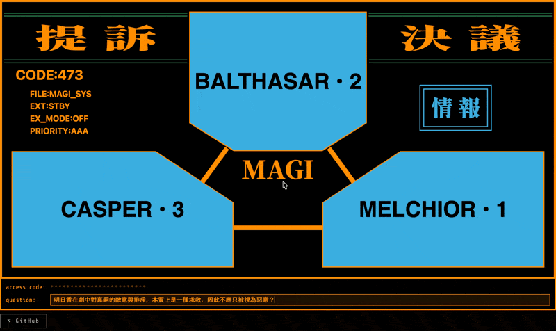

# MAGI 系統

一個以《新世紀福音戰士》中的 MAGI 超級電腦為靈感製作的粉絲向 Web 應用程式。輸入一個是非題，三台 AI 電腦將同時進行審議，以多數決得出最終裁決。

**[English](README.md) | [日本語](README.ja.md)**



---

## 三台電腦

| 電腦 | AI 模型 | 視角 |
|------|---------|------|
| MELCHIOR • 1 | OpenAI GPT | 科學家——邏輯、理性分析 |
| BALTHASAR • 2 | Anthropic Claude | 母親——保護、關懷導向 |
| CASPER • 3 | Google Gemini | 女性——直覺、情感洞察 |

## 裁決結果

| 結果 | 說明 |
|------|------|
| **承認（APPROVE）** | 多數贊成 |
| **否決（REJECT）** | 多數反對 |
| **棄権（ABSTAIN）** | 兩台以上棄権 |
| **膠着（DEADLOCK）** | 無多數決定 |

> **重大議題（Critical Matter）**：若兩台以上判定議題屬於不可逆且可能造成重大危害的事項（如自爆、殺傷等），系統將自動切換為全票制——三台必須一致同意才能執行，任何一台反對或棄権均視為否決。點擊各台電腦可查看其是否判定為重大議題。

## 開始使用

### 前置需求

您需要以下服務的 API 金鑰：

- [OpenAI](https://platform.openai.com/api-keys) — 供 MELCHIOR-1 使用
- [Anthropic](https://console.anthropic.com/settings/keys) — 供 BALTHASAR-2 使用
- [Google AI Studio](https://aistudio.google.com/apikey) — 供 CASPER-3 使用

### 本地開發

```bash
# 1. 複製倉庫
git clone https://github.com/hirakujira/MAGI.git
cd MAGI

# 2. 設定環境變數
cp .env.local.example .env.local
# 編輯 .env.local 並填入您的 API 金鑰

# 3. 安裝相依套件
npm install

# 4. 啟動開發伺服器
npm run dev
```

開啟 [http://localhost:3000](http://localhost:3000)。

### Docker

```bash
# 先複製並設定環境變數
cp .env.local.example .env.local

docker compose up
```

## 環境變數

| 變數名稱 | 說明 | 預設值 |
|----------|------|--------|
| `OPENAI_API_KEY` | OpenAI API 金鑰（MELCHIOR-1） | — |
| `OPENAI_MODEL` | OpenAI 模型名稱 | `gpt-4o-mini` |
| `ANTHROPIC_API_KEY` | Anthropic API 金鑰（BALTHASAR-2） | — |
| `ANTHROPIC_MODEL` | Anthropic 模型名稱 | `claude-haiku-4-5` |
| `GOOGLE_API_KEY` | Google AI API 金鑰（CASPER-3） | — |
| `GOOGLE_MODEL` | Google 模型名稱 | `gemini-2.5-flash` |

## 使用方式

1. 在輸入欄輸入是非題形式的議題，按下 **Enter** 送出
2. 三台電腦同時開始獨立審議
3. 率先完成的電腦立即停止閃爍並顯示結果
4. 三台全部完成後，以多數決顯示最終裁決
5. 點擊任一電腦可查看詳細推理說明

## 版權聲明

本專案為粉絲向作品，向庵野秀明 / GAINAX / khara 所創作的《新世紀福音戰士》致敬。所有福音戰士相關名稱與概念均屬各著作權人所有。

## 致謝

### 贊助者

特別感謝以下人士贊助 API Token 費用：

- 天上天下唯我翻車大皮粉
